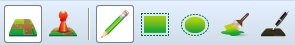
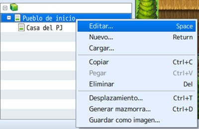

# Clase 1: Creando mapas

En esta clase nos adentraremos un poco mas en RPG Maker, viendo en esta ocasión la generación de mapas, estructurándolos y configurándolos.

Dentro de las configuraciones, veremos conceptos como la dimensión de los mapas, los tipos, fondos de paralaje y los sonidos del mismo.

Asi mismo, veremos también los **tilesets** y como utilizarlos adecuadamente en cada representación, para obtener la mejor coherencia en mapa.

## Objetivos del día

- Conocer las diferentes herramientas de los mapas y su utilización.
- Aprender a configurar totalmente un mapa y realizar cambios en el sobre la marcha.
- Aprender la utilización y configuración de **tilesets** y las combinaciones entre estos.
- Transmitir todo lo aprendido a nuestro **proyecto principal**. 

## Teoría
---
### Creando mapas

Es una tarea sencilla e intuitiva, aunque llevará tiempo según el nivel de detalle que quieras darle a cada mapa. Para empezar, el RPG Maker MV (RMMV, para acortar) introduce la autocapa, un sistema que superpone diferentes tiles sin borrar el de debajo. Por eso, cada tileset se divide en varias capas (de A hasta E), donde se agrupan texturas de diferentes tipos; por ejemplo, la capa A es la más baja de todas, representando superficies (agua, caminos, hierba, paredes exteriores, tejados, etc.) que deberán estar por debajo de otros objetos.
Y éstos estarán representados por las demás capas (B a E). Es cuestión de ir probando para ver los resultados. 

>**Nota:** no todos los tilesets tienen todas las capas activas, como se puede observar en los que vienen por defecto. Esto permitiría editarlos.
Para empezar, hay que seleccionar el modo mapa; también, conocer las opciones del menú dibujo (a las que se accede rápidamente desde la barra de herramientas). Y saber que el tileset elegido (y sus capas), estará a la izquierda.

#### ¿Y cómo se añade un mapa? 

Por defecto, se crea un mapa inicial; pero si quieres añadir uno o más mapas a tu proyecto, debes ir a la parte izquierda-baja de la ventana y hacer click derecho sobre la línea del proyecto (el icono del cubo) o sobre MAP001, por ejemplo. Depende de dónde quieras colocar el nuevo mapa.

Aparecerá la ventana de propiedades, también disponible haciendo click derecho sobre el mapa y eligiendo editar.

**Nombre y nombre de visualización:** el nombre que tendrá el mapa en el editor y en el juego, respectivamente.

**Juego de casillas:** menú para elegir el tileset. Es una traducción literal de set of tiles (juego de casillas/baldosas). Esto definirá el tipo de mapa a dibujar: supramundo (mapamundi); exterior (pueblos, ciudades, aldeas, bosques, etc.); interior (casas, tiendas, castillos, etc.); mazmorra (dungeons); CF exterior e interior (como exterior e interior, pero con un toque moderno/futurista). Se pueden crear tilesets en la base de datos.

**Anchura y altura:** por defecto, 17×13 tiles (representa la resolución del juego, de 816×624). Puedes introducir una cifra entre 0 y 256.

**Tipo de desplazamiento:** define si los extremos de un mapa están conectados o no.

**Encuentros pasos:** define el número medio de pasos para los encuentros. Es decir, los pasos que da el PJ para encontrarse con un enemigo especificado en encuentros.

**Reproducción automática BGM y BGS:** puedes seleccionar música de fondo y sonido de fondo, que sonará cuando entres al mapa (sin necesidad de un evento).

**Especificar fondo de batalla:** seleccionar una imagen (o combinación) como background para las batallas.

**Deshabilitar embestida:** se refiere a deshabilitar el ir corriendo constantemente en ese mapa. La traducción viene de “dashing”, que sería ir con prisa.

**Fondo de paralaje:** una imagen de background visible cuando hay casillas transparentes en el mapa.

>**Nota:** para apuntar cosas particulares sobre el mapa (como una agenda), e introducir líneas de código para determinados plugins. Esto no se verá en el juego; sólo en el editor.

**Encuentros:** se definirán los enemigos que habrá en el mapa. Click derecho sobre la primera línea (blanca) para que aparezca el menú. Al editar cada encuentro, se puede definir el tipo de tropa, su peso (la probabilidad de que aparezca con respecto a otras tropas) y la zona del mapa donde se producirá el susodicho.

Si te fijas, cada tileset tiene una pestaña R: sirve para pintar regiones en el mapa (de 1 a 255). Esto definirá zonas en el mismo, donde por ejemplo podría aparecer un grupo de orcos (definido en las propiedades del mapa, en encuentros). Por defecto, cualquier encuentro definido se dará en todo el mapa.

Para terminar, explicaré el menú de opciones disponible al hacer click derecho sobre un mapa.

**Editar:** entra en la ventana de propiedad del mapa.

**Nuevo:** crea un nuevo mapa bajo el seleccionado.

**Cargar:** crea un nuevo mapa a partir de presets (por defecto en el programa). Hay bastante variedad.

**Copiar:** duplica el mapa seleccionado en el portapapeles.

**Pegar:** añade el mapa existente en el portapapeles.

**Eliminar:** borra el mapa seleccionado.

**Desplazamiento:** permite jugar con las casillas del mapa, moviéndolas en uno de los ejes o en ambos.

**Generar mazmorra:** crea un dungeon a partir de las opciones elegidas.

**Guardar como imagen:** genera una imagen del mapa seleccionada y la guarda en la carpeta especificada.

