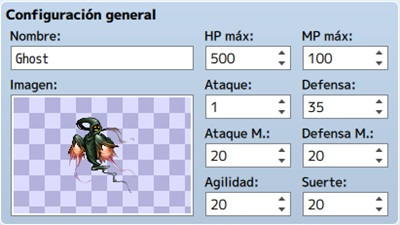
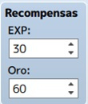
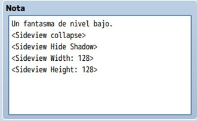
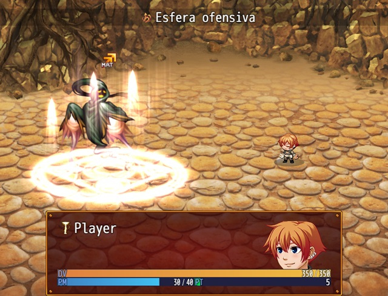

# Clase 10: Creación de enemigos

Ya hemos visto los enemigos que hay en RPG Maker y como añadirlos en nuestros juegos,pero ¿y si creamos los nuestros?, asi podríamos tener enemigos que se adaptasen a nuestras necesidades, sin mencionar que tendrían la apariencia que nosotros quisiéramos.

En esta clase aprenderemos a diseñar **nuevos enemigos** desde su apariencia (sprite), pasando por sus diálogos, sus habilidades y sus funciones en general. Para esto RPG Maker nos brinda multitud de herramientas, como un editor de sprites, un editor de recompensas, etc.

## Objetivos del día

- Hacer un boceto de nuestro enemigo personalizado.
- Crear una lista de diálogos para nuestro enemigo.
- Crear una apariencia nueva para nuestro enemigo.
- Crear un set de habilidades nuevas.
- Crear un enemigo completo con un botín personalizado.
- Implementar todo lo aprendido a nuestro proyecto principal.

## Teoría
---
#### Cómo crear un enemigo

De vuelta a la base de datos del RPG Maker MV. En este caso, iremos a la pestaña “Enemigos” para explicar detalladamente qué hacer.

Antes que nada, has de tener en mente una idea aproximada de cuántos enemigos habrá en tu partida. Esto es, para aumentar el máximo que viene por defecto; aunque, como es habitual, se puede retocar a medida que avances en el proyecto. En mi caso, reservaré veinticinco espacios.

Además, si tu idea es tener un número ingente de enemigos, es aconsejable que dividas la lista en secciones. Es decir, poniendo a enemigos mágicos juntos, enemigos físicos, enemigos elementales de fuego, etc.

>**Nota:** si tienes algunos nombres en mente, puedes ir apuntándolos en los diferentes espacios, en pos de no olvidarlos y de ver si necesitas aumentar el máximo de huecos.

Tras esto, elige un lugar vacío de la lista o edita un enemigo existente para comenzar.
Como verás, cada enemigo se divide en seis apartados: configuración general, recompensas, artículos obtenidos, atributos, patrones de acción y nota.

#### Configuración general

Básicamente, se establece el nombre, la imagen y los parámetros básicos del enemigo. No tiene mayor dificultad, sabiendo si vas a crear un enemigo duro de pelar, mágicamente poderoso o con un gran ataque físico, por poner ejemplos. En mi caso, el Ghost es un lanzador de hechizos con buena defensa física, nada de ataque físico y el resto de parámetros sobre la media.

#### Recompensas de enemigo

Aquí dispondremos la cantidad de experiencia y de oro que da cada enemigo de este tipo, al ganar el combate.
Si es uno difícil de vencer o provoca un gasto elevado de ítems (pociones, elixires, etc.), sabrás si aumentar la EXP o el oro recibido.

#### Artículos obtenidos

Recompensas extra que suelta el enemigo tras vencer. Por defecto, está limitado a tres; si necesitas más, hay algún plugin que lo soluciona, o puedes configurarlo en el evento creado para el combate.

Cada artículo que especifiques tendrá una posibilidad de aparecer (en forma de fracción); desde 1/1 (esto es, un 100% de probabilidad) hasta 1/1.000 (saldrá una vez cada mil combates con este enemigo). Por ejemplo, si es un jefazo final y quieres premiar al jugador con una armadura mágica, selecciona una probabilidad adecuada (1/2 sería un 50%, sabiendo que el combate es muy duro); después de todo, ese enemigo sólo aparecerá una vez en la partida. Sin embargo, si creas un murciélago o una rata, puedes configurar un objeto valioso (una espada mágica) con una probabilidad de 1/500, porque en tu proyecto, el jugador se encontrará infinidad de veces con esos tipos de enemigo.

#### Atributos

Puede que sea el apartado más complejo de configurar, ya que hay muchísimas opciones. No obstante, sabiendo qué tipo de enemigo estás creando, no deberías liarte demasiado. Por lo general, hay tres atributos básicos: 

- Tasa de acierto (ex-parámetro)
- Tasa de evasión (ex-parámetro)
- Elemento de ataque

A partir de éstos, ajusta al enemigo a tu gusto, en base a su naturaleza. Por ejemplo, el Ghost es un ser proveniente de la oscuridad; por ello, su elemento de ataque es “oscuridad” (en vez de “físico”). Esto significa que, si un PJ fuese débil al elemento oscuridad (tasa del elemento oscuridad por encima del 100%), los ataques del Ghost le harían más daño de lo normal.

Otro atributo interesante es “resistencia estado X (sueño, por ejemplo)”, haciendo que el enemigo sea invulnerable al estado X (sueño).

#### Patrones de acción

En este apartado se definen las acciones que podrá realizar el enemigo en batalla. Importante tener en cuenta la prioridad (la columna “R”), seleccionada en Clasificación (al hacer doble click sobre una línea vacía o una acción definida, para editarla): se refiere a la probabilidad de esa habilidad se realice sobre el resto, teniendo en cuenta que el número más alto tiene la mayor prioridad. Las habilidades con uno o dos puntos menos se llevarán a cabo en un menor porcentaje; las que tengan tres o más puntos menos, no se realizarán. Por ejemplo, las acciones definidas para el Ghost se realizarán todas (en mayor o menor probabilidad), ya que la prioridad más alta es 5 y la más baja es 3.

Otro dato a tener en cuenta es la condición (configurada también al hacer doble click), que define cuándo se podrá realizar una habilidad. Por defecto, toda habilidad se realizará siempre, teniendo en cuenta la prioridad. Esto es, si tres habilidades tienen la misma prioridad y condición (5 y siempre, por ejemplo), será como tirar un dado de tres caras: habrá un 33% de probabilidad para cada una. En cambio, si una habilidad tiene cierta condición para llevarse a cabo, ésta tendrá que cumplirse (además de tener en cuenta la prioridad) para que el enemigo la realice.

#### Configurando notas

Este cuadro de texto se usa para apuntar información o detalles sobre el enemigo, o para usar etiquetas propias de algún plugin (AnimatedSVEnemies de Yanfly), por ejemplo. Lo escrito aquí no se visualiza en la partida; es código para uso interno o comentarios (estilo //texto-que-sea en JavaScript).

Por último, para probar al enemigo recién creado, iremos a la pestaña “Tropas” y la configuraremos en un espacio de la lista (recomiendo aumentar el máximo). Luego, pulsa “Prueba de batalla” y aparecerá la ventana del juego con el combate correspondiente; así es más fácil comprobar si el enemigo es buen oponente, según el nivel del PJ.

