# clase 11: Crear una NPC tienda

En algunas partes de la aventura necesitamos que el jugador pueda reabastecerse y en comprar nuevos suministros para su aventura, por lo que es necesario crear lugares donde este pueda adquirirlos.

En esta clase veremos los conceptos básicos que deben respetar las tiendas y como estas afectan en la dificultad del juego.

Ademas aprenderemos a implementar todo esto en RPG Maker y veremos los diferentes tipos de tienda que podemos crear.

## Objetivos del día

- Conocer la importancia de los vendedores/tiendas en los juegos.
- Conocer el balance al juego que aporta este recurso.
- Aprender a crear una tienda básica
- Aprender a diseñar un mapa de tienda.
- Implementar todo lo aprendido a nuestro proyecto principal. 

## Teoría
---
#### Creando una tienda

Una tienda en RPG Maker es un concepto muy utilizado cuando queremos que el jugador disponga de un punto en donde comerciar y poder obtener beneficios varios. Las entidades comercian con la moneda del juego en este caso **oro** y no se admiten trueques u otro tipo de intercambio.

Para definir una tienda necesitamos crear un evento especifico, por lo que primero debemos cambiar al modo eventos, una vez alli haremos doble clic sobre el recuadro donde querramos posicionar al vendedor y se abrirá el panel de eventos.

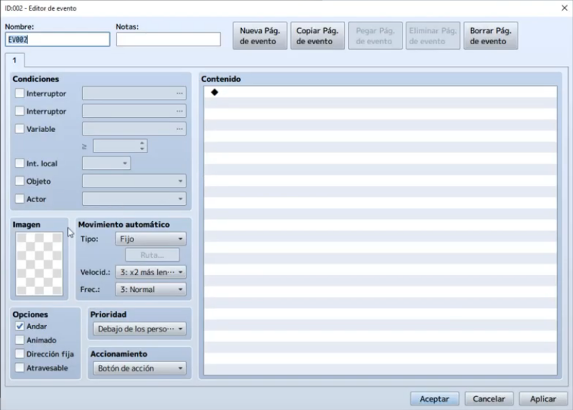

Una vez allí daremos **doble clic** sobre la sección de **imagen**, a continuación se nos abrirá un menu de selección de miniaturas de personajes, escogeremos la que mas se ajuste a nuestra necesidades.

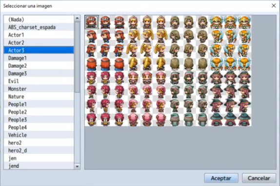

Una vez hecho esto, empezaremos con la configuración del evento en la sección de contenido.

En este caso daremos doble clic en la zona de contenido y nos aparecerá una ventana con todas las opciones de evento disponibles, nosotros buscaremos la de **mostrar mensaje** que esta en la pestaña 1.

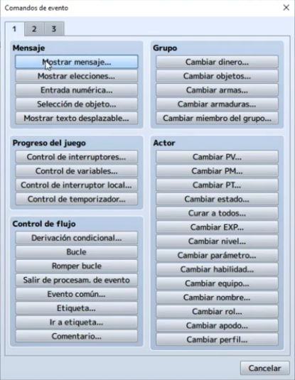

A continuación seleccionaremos un rostro adecuado para la miniatura escogida anteriormente y un texto para el diálogo.

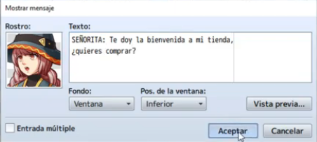

Con esto ya tendremos un NPC con un diálogo como ya habíamos visto antes, ahora necesitamos que nos deje elegir, para ello volveremos a la sección de contenido y daremos doble clic para desplegar las opciones de evento disponibles y seleccionaremos **mostrar elecciones**.

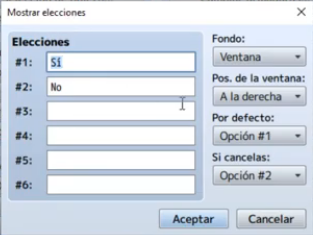

Aceptaremos el cuadro y ahora daremos un contenido para la elección **SI** y para la 
elección **NO**.

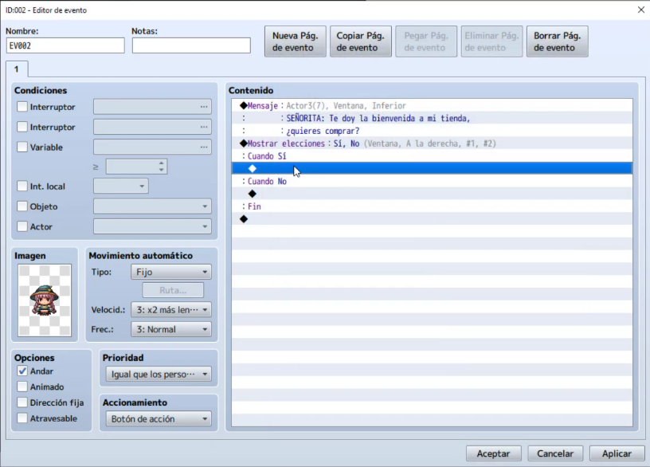

- Opción **SI** : En esta opción queremos que se ejecute la tienda por lo que en este campo introduciremos el evento de la tienda, haciendo doble clic en esa zona y seleccionando la opción **procesar tienda** de la pestaña 3.

    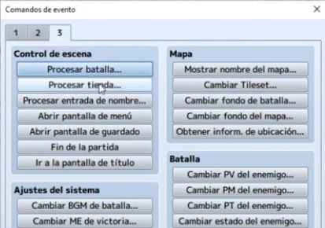

    Ahora configuraremos el contenido de la tienda, de esta forma podemos crear tiendas que solo vendan armaduras o que vendan solo armas, etc.

    Para esto, daremos doble clic en alguno de los espacios del meno de procesar tienda.

    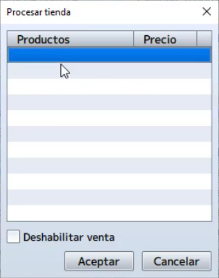

    Hecho esto, nos aparecerá una ventana para la selección de objetos en venta, divididos en 3 categorías (objeto, arma y armadura), asi como también la configuración del precio que podemos dejarla a decisión del juego o ajustarla manualmente.

    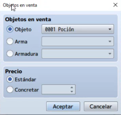

    Una vez cargada la tienda con algunos productos daremos a aceptar.

    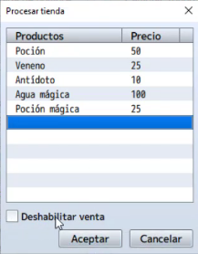

- Opción **NO** : Para esta opción sencillamente queremos que la conversación con el NPC termine, por lo que no hara falta colocar nada.

Con esto ya tendremos nuestro NPC tienda preparado para comerciar con nuestro personaje. 

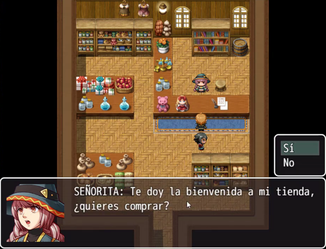

