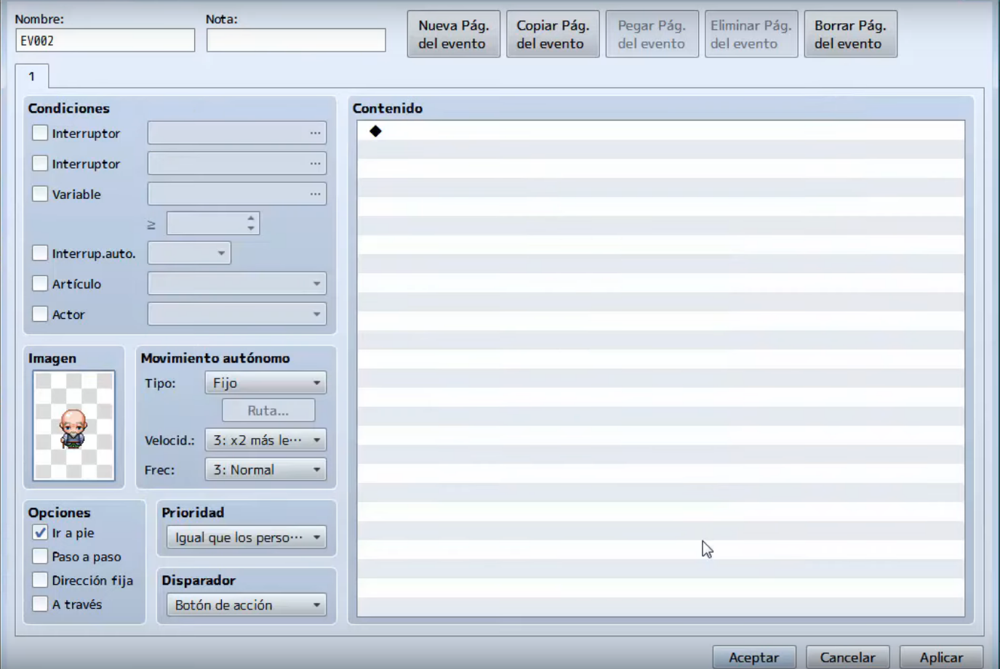
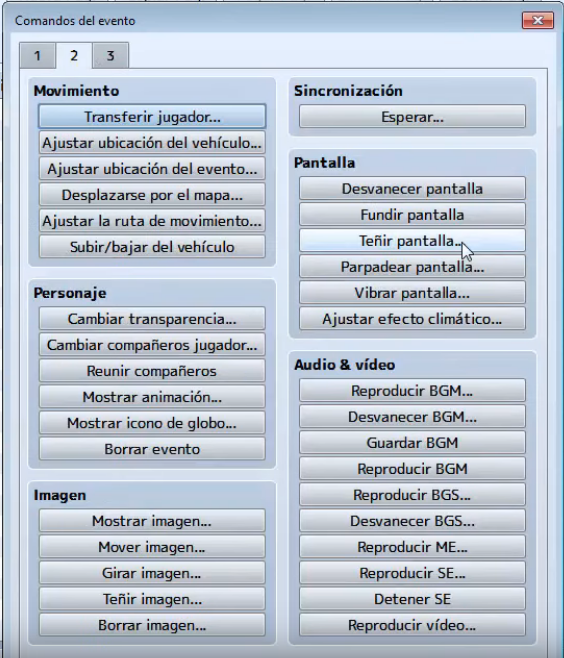
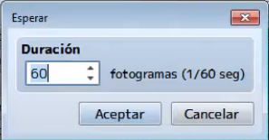
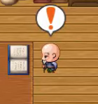
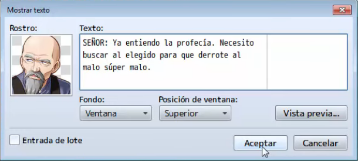
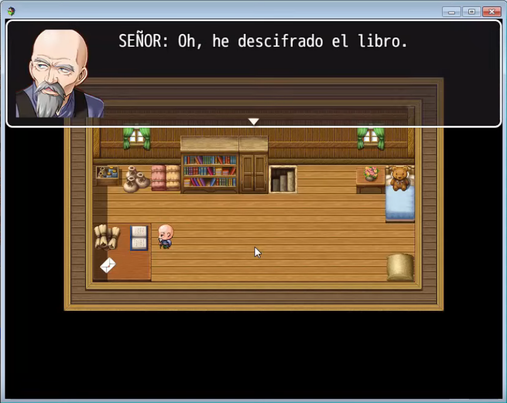

# Clase 12: Eventos automáticos (Cinemáticas)

Ya hemos aprendido los conceptos básicos para crear un juego medianamente aceptable, sin embargo, existen eventos en el juego que se realizan de forma automática y que podemos usarlos para contar parte de la historia, por ejemplo como una cinemática inicial que explique por que comienza nuestra aventura.

En esta clase aprenderemos a crear eventos automáticos en RPG Maker y a utilizarlos como medio para contar una historia o una situación en concreto.

Ademas idearemos la historia que relatará dicha cinemática, teniendo en cuenta la coherencia con el resto de lo que queramos contar.

## Objetivos del día

- Conocer la importancia de las escenas de inicio en los juegos.
- Aprender a crear eventos automáticos.
- Aprender a crear escenas iniciales.
- Desarrollar un argumento para dicha escena inicial.
- Implementar todo lo aprendido a nuestro proyecto principal.

## Teoría
---
#### 

Las animaciones son eventos que se ejecutan automáticamente en nuestros juegos y pueden ser usadas para introducir al jugador a nuestra historia ademas de que dotan al juego de vida propia.

Vamos a realizar un evento automático sencillo haciendo que un personaje se dirija de un punto a otro y realice un diálogo.

Empezaremos creando un NPC con la imagen que mas nos convenga a la historia.

A este evento con la imagen del NPC le daremos un nombre identificativo en la parte de arriba a la izquierda, en la propiedad de nombre (para este ejemplo lo llamaremos **señor**).

A continuación planificaremos de donde a donde el personaje se moverá, para este ejemplo ira de izquierda a derecha de la sala.

Ahora debemos configurar el evento, esto se realiza creando **un evento a parte** del NPC (por ejemplo en una esquina del mapa), este evento contendrá todo lo que sucederá en la cinemática, en este ejemplo queremos primero una pantalla en negro mostrando un texto, para luego dar lugar a la cinemática. Primero teñiremos la pantalla, para esto añadiremos un nuevo evento y seleccionaremos **teñir pantalla** en la pestaña 3.

Ya en la ventana de teñir seleccionaremos en color negro, ademas en la opción de duración colocaremos el valor de **1** y desmarcaremos la casilla de **Esperar hasta el fin**, finalizaremos dando a aceptar.

Para el texto que se mostrará sobre la pantalla negra agregaremos un nuevo evento haciendo doble clic sobre la zona de contenido y buscaremos la opción de evento de **mostrar texto** en la pestaña 1.

Colocaremos el texto que queramos, ademas cambiaremos la opción fondo por **transparente** y en la opción de posición de ventana seleccionaremos **centro**.

una vez terminado el texto volveremos a teñir la pantalla para quitar el negro. (con los valores como en la imagen).

Ahora para darle un comportamiento mas natural, haremos que el evento espere 60 fotogramas o lo que lo mismo 1 segundo. Para ello agregaremos un evento y en la pestaña 2 la opción de **esperar**.

Ahora agregaremos el evento para que el NPC creado antes se mueva automáticamente, para esto buscamos la opción de evento **ajustar ruta de movimiento** en la pestaña 2. El panel que nos aparece, antes que nada debemos especificar el NPC que se moverá, para esto debemos ir al desplegable que esta arriba a la izquierda (para nuestro ejemplo el NPC se llama **señor**), por otro lado en la parte central tenemos una botonera con comandos de movimiento, la forma de especificarlo es ir colocando en secuencia los movimientos que queramos, en este caso queremos que el NPC se mueva a la izquierda unos 6 pasos, por lo que tendremos que colocar **Mover hacia izquierda** 6 veces.

Para finalizar debemos marcar la casilla **Esperar hasta fin**

Ahora para darle mas realismo a la escena vamos hacer un efecto de sonido para dar la impresión de que lee un libro. Para ello vamos a añadir un nuevo evento llamado **Reproducir SE**, que esta en la pestaña 2.

> Seleccionamos el efecto sonoro que aparece en la imagen.

Haremos que espere un segundo (de la forma que ya hemos visto), para a continuación reproducir el sonido que acabamos de colocar una vez mas.

Ahora queremos que el NPC de a entender su sorpresa al leer el libro con un icono sobre su cabeza (un icono de globo), añadiremos un nuevo evento llamado **mostrar icono de globo**. Elegimos al NPC sobre el cual se mostrará el icono y escogeremos el icono de **exclamación**, por ultimo marcaremos la casilla de **Esperar hasta fin**. 

Con lo que el resultado que veremos luego en el juego será el siguiente:

Para finalizar añadiremos un texto con la conclusión a la que llega el personaje después de leer el libro, por lo que añadiremos un evento de diálogo con **mostrar texto**.

Ahora debemos tener en cuenta que, para que se realice el evento debemos tener al jugador (o al menos el NPC del personaje jugador) en el mapa de la cinemática, por obvias razones nuestro personaje no va a aparecer en la cinemática por lo que debemos cambiar su opacidad para que no sea visible, para esto agregaremos una linea de evento y seleccionaremos la opción **Ajustar ruta de movimiento** de la pestaña 2 y dentro escogeremos la opción de **Cambiar opacidad...** que estableceremos a **cero**.

Con esto, conseguiremos que el jugador no sea visible hasta que volvamos a ajustar su opacidad. A continuación transportaremos al jugador a su zona de inicio, para esto agregaremos linea de evento y seleccionaremos **Transferir jugador** de la pestaña 2 y escogeremos como destino la zona de inicio.

Una vez que el jugador este en su lugar correspondiente ya podemos cambiar su opacidad para que pueda ser visible, para esto agregamos una nueva linea de evento y seleccionaremos **Ajustar ruta de movimiento** de la pestaña 2 y dentro escogeremos la opción de **Cambiar opacidad...** que estableceremos a **255**.

Con esto ya tendremos terminada la cinemática y bastará con lanzar el juego para poder verla.

