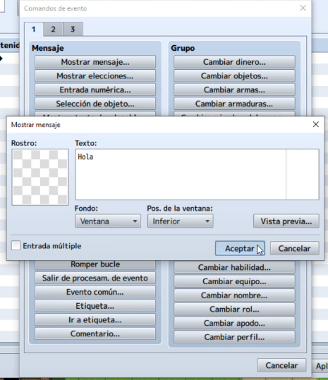
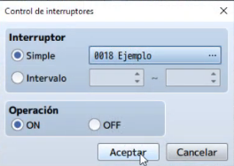
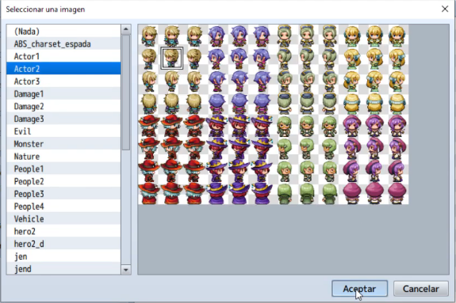
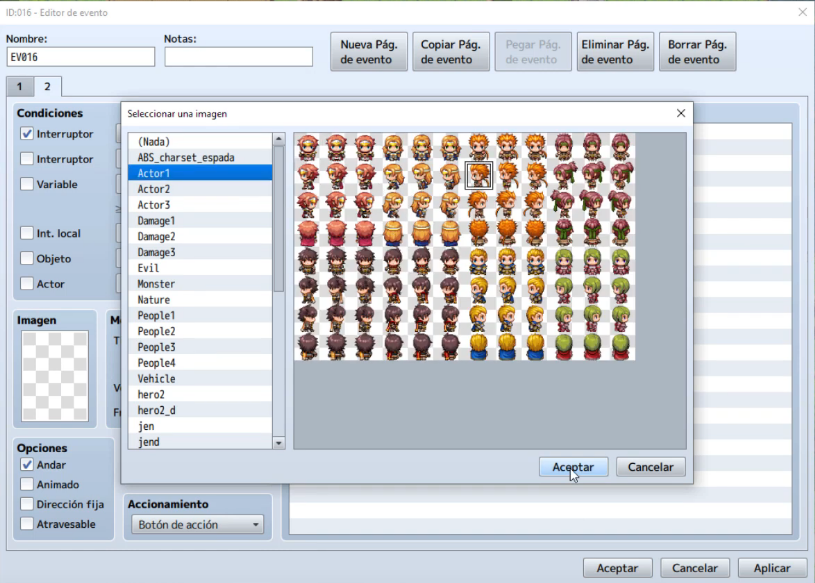

# clase 13: Interruptores

Ha llegado el momento de darle a nuestro juego un comportamiento dinámico, esto significa que nuestro juego se comportará de una forma distinta dependiendo de las condiciones actuales. Dichas condiciones pueden cambiar mediante eventos, por ejemplo, tener un objeto en concreto, suceder a una hora determinada, etc.

En esta clase aprenderemos a crear variables o interruptores y sus diferentes tipos(globales o locales). También aprenderemos a vincularlos a eventos del juego y asi obtener comportamientos dependientes de la situación.

Daremos también un vistazo a la programación básica con el uso de los condicionales y como integrar los interruptores en estos.

## Objetivos del día

- Conocer los interruptores y su uso en los juegos.
- Conocer los eventos dependientes.
- Aprender a crear interruptores globales.
- Aprender a crear interruptores locales.
- Aprender a crear eventos que cambien el estado de los interruptores.
- Aprender a crear un evento condicional.
- Implementar todo lo aprendido a nuestro proyecto principal.

## Teoría
---
### Qué son los interruptores

Los interruptores son un tipo de variable que almacenan solo 2 estados, **on** y **off**. Estos dos estados nos permiten definir condiciones dependiendo del estado del interruptor.

Por ejemplo si queremos que ocurra un determinado evento solo cuando a sucedido otro previo que es necesario en la historia, podemos usar los interruptores.

> Nota: todos los interruptores de RPG Maker, estan por defecto en **off**.

### Implementando un evento con interruptores

Vamos a realizar un ejercicio para ver la potencia de los eventos, en este ejercicio cambiaremos la apariencia de un NPC dependiendo de un interruptor que se activará cuando hablemos con otro NPC.

Creamos entonces un evento y asignamos una imagen para el NPC con el que vamos a hablar para activar el interruptor.

Ahora haremos que NPC nos diga un mensaje para ver si funciona correctamente el evento.

Y ahora creamos la linea de evento para el interruptor, para ello iremos a la opción de **Selección de interruptor**, dentro de este menú veremos todos los interruptores que posee el juego, existe un número máximo de interruptores, pero este puede ser cambiado por un número mas alto. Para nuestro ejemplo crearemos un nuevo interruptor dando click en la zona libre con los nombre de interruptores y escribiendo el nombre en el campo **Nombre**, lo llamaremos *Ejemplo*. 

Ahora marcaremos teniendo seleccionado el interruptor **Ejemplo** marcaremos la casilla **ON** de la sección **Operación**.

Con esto ya tenemos el NPC preparado para que cambie el estado del **interruptor**, ahora crearemos el otro NPC que será el que cambie su apariencia, para esto crearemos un nuevo evento y le daremos una imagen inicial al NPC.

Ahora haremos algo nuevo, crearemos una nueva pagina de evento que solo ejecutará si el evento esta en **ON**, para ello iremos a la parte superior de la ventana de eventos y pincharemos en el botón de **Nueva Pág. de evento**, con esto se nos creará una nueva pagina de evento. A continuación dentro de l página nueva de evento, iremos al panel izquierdo y marcaremos en la sección de **Condiciones** la casilla de **Interruptor** y seleccionaremos en el desplegable nuestro interruptor llamado **Ejemplo**.

con esto conseguiremos que solo se active si el interruptor ejemplo está a **ON**. Una vez hecho esto daremos una imagen para el NPC en esta nueva página de evento (que sera la imagen a la que cambiará).

Con esto ya tendremos creado nuestro interruptor para hacer el cambio de apariencia, solo tendremos que hablar con el NPC **desencadenante**.

