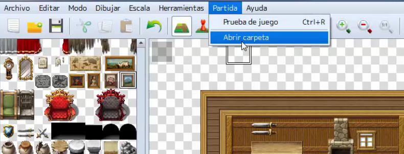
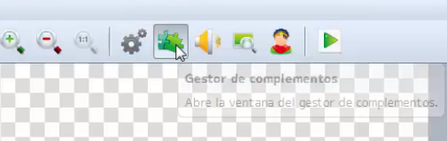

# Clase 14: Plugins

En algunos casos RPG Maker tiene ciertas limitaciones nativas, es decir, algunas funcionalidades que tal vez queremos implementar en nuestro juego no vienen por defecto en las herramientas, por lo que nos vemos obligados a recurrir a archivos externos a RPG Maker para agregar dichas funcionalidades.

En esta clase veremos como instalar plugins en RPG Maker, ademas de ver como proceder para su activación y ejecución.

También veremos de donde obtener estos plugins y cuales son los mas usados por la comunidad de desarrollo de RPG Maker.

## Objetivos del día

- Conocer el concepto de plugin.
- Conocer los limites de RPG Maker y cuando debemos recurrir a un plugin.
- Aprender a instalar un plugin.
- Aprender a ejecutar un plugin.
- Conocer las páginas mas importantes de desarrollo de plugins.
- Implementar todo lo aprendido a nuestro proyecto principal.

## Teoría
---
### ¿Qué es un plugin?

Un plugin es un recurso que añade nuevas funcionalidades a los programas, en el caso de RPG Maker son fragmentos de código en un lenguaje de programación llamado JavaScript.

RPG Maker es amigable con los plugins desarrollados por terceros, lo que nos permite instalarlos sin muchas dificultades. Para nuestro ejemplo descargaremos un plugin que cambia la resolución de pantalla.

### Instalando el plugin

Primero nos dirigiremos a la página que desarrolla el plugin

> http://yanfly.moe/yep/

Una vez allí buscaremos el pluggin llamado `Screen Resolution`, este pluggin esta al final de la lista en la sección de **Misc Plugins**. Cuando hayamos entrado al link, se nos cargará una página web con un texto, este texto es el script de JavaScript del pluggin.

La pregunta ahora es ¿donde copio este código?. Para responder esa pregunta primero debemos saber la ubicación de los archivos de nuestro proyecto, para esto en RPG Maker iremos al menu del panel superior y buscaremos la opción de **Partida** y dentro buscaremos la opción de **Abrir carpeta**.

Esta carpeta contiene todos los datos de nuestro juego como la música, las imágenes, los sprites y por supuesto los **Scripts**. Dentro de esta carpeta buscaremos la subcarpeta llamada **js**, y dentro de esta buscaremos una llamada **plugins**. Dentro de esta carpeta se encuentran todos los scripts de los plugins.

Dentro de la carpeta plugins, crearemos un nuevo archivo de texto, dentro de esta pegaremos el contenido del script de la página web que contiene el script y guardaremos. Aquí surge un problema ya que RPG Maker solo interpreta archivos con extensión **.js** 

Por loq que debemos cambiar la extensión del archivo, para esto daremos click derecho en el archivo y daremos a la opción de **Cambiar de nombre** y cambiaremos el nombre del archivo a **ScreenResolution.js**, una vez hecho esto cerraremos la carpeta e iremos al programa RPG Maker.

Dentro de RPG Maker, en el panel superior buscaremos el icono del **Gestor de complementos**.

Dentro del gestor veremos una ventana vacía, esto es debido a que aún no hemos habilitado ningún complemento, para esto daremos doble click en cualquier espacio en blanco y se nos abrirá el explorador de complementos, donde seleccionaremos nuestro plugin por el nombre del archivo.

Una vez elegido, el gestor nos mostrará la opciones del plugin, este plugin modifica la resolución de la ventana del juego, por lo que nos mostrara las variables con las dimensiones de **Screen Width** y **Screen Height** (ancho y alto en ingles), para modificar estos valores es tan sencillo como dar doble click al valor y escribir uno nuevo.

Aceptamos la ventana y con esto ya tenemos el plugin funcionando en nuestro juego.