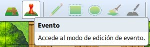
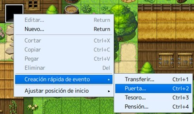
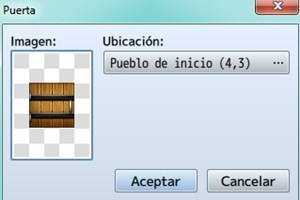

# Clase 2: Creando eventos

En esta clase estudiaremos el concepto de eventos en los videojuegos y los disparadores de los mismos, también su importancia en nuestros proyectos y los beneficios de su implementación.

Ademas veremos como utilizar la herramienta evento de RPG Maker. Ademas veremos como generar los diferentes eventos de los que disponemos y acoplarlos a nuestros mapas.

Aprenderemos a como crear desde sencillos eventos rápidos predefinidos, hasta eventos hechos a la medida de nuestras necesidades con el fin de darle vida a nuestros mundos virtuales.

## Objetivos del día

- Conocer los conceptos de eventos y desencadenantes.
- Conocer la herramienta **evento** de RPG Maker.
- Conocer los diferentes modos de eventos rápidos que nos proporciona RPG Maker.
- Aprender a crear un evento rápido e implementarlo en nuestro proyecto.
- Conocer la creación de un evento personalizado y su respectiva configuración.
- Aprender a desplegar un evento personalizado con la creación de **enemigos** y NPCs amistosos.
- Implementar todo lo aprendido a nuestro proyecto principal.

## Teoría
---

### Añadiendo eventos

Una posible definición de evento es: algo que ocurre en condiciones determinadas. En definitiva, acciones que van a suceder en el mapa, en batalla o de forma común (estos dos últimos se definen en la base de datos, en tropas y eventos comunes, respectivamente).

A este respecto, hay tantas posibilidades y tan vasto es el conocimiento en Internet (y el mío tan reducido), que voy a centrarme en los eventos rápidos de mapa. Para otros, mejor investigar; si puedo ayudar en algo, lo haré.
Antes que nada, hay que seleccionar el modo evento:

Tras esto, elegir el tile (casilla) donde quieras colocar el evento y hacer click derecho. Aparecerá el menú secundario; selecciona Creación rápida de evento > Puerta (servirá para colocar una puerta en un edificio, por ejemplo). 

> **Una recomendación:** cuando pintes el edificio, acuérdate de poner una abertura para la puerta (el cuadrado negro que se ve en la imagen). Así, la transición del evento se verá más natural; de otro modo, la puerta se abriría y se vería la pared exterior.

En la ventana que aparecerá, se podrá definir el gráfico de la puerta (haz doble click donde la imagen) y la posición a la que irá el PJ (podrás cambiar de mapa, por supuesto). Es un evento rápido muy fácil de asimilar.

Los otros tres eventos rápidos también son sencillos. Paso a explicar sus opciones:

- **Transferir :** Acciona el teletransporte de un mapa a otro, o de una zona a otra (del mismo mapa). Las coordenadas se ajustan en ubicación y el menú dirección ajusta el sprite del personaje (cómo quedaría en pantalla, mirando hacia arriba, abajo, derecha o izquierda). 
- **Tesoro :** coloca un cofre en el tile seleccionado, posibilitando que se obtenga oro (dinero), objetos, armas o armaduras. El gráfico del contenedor se puede cambiar en imagen, y en contenido se elegirá lo que guarde. 

> **Nota:** este evento se puede editar para que un cofre suelte más de un objeto.