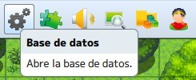
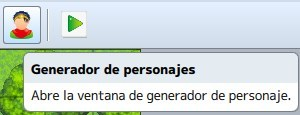

# Clase 3: La base de datos

En esta lección aprenderemos los conceptos de bases de datos en el marco del desarrollo de videojuegos y de su importancia como fuente de recursos. Ademas veremos como funciona la base de datos de RPG Maker mediante la exploración de esta.

Aprenderemos también la configuración y modificación de la base de datos para adaptarla a nuestros proyectos.

Por otro lado daremos un vistazo al generador de personajes, y crearemos nuestros propios personajes para exportarlos y usarlos en nuestro juego, teniendo siempre en cuenta la coherencia con nuestra historia.

## Objetivos del día

- Conocer el concepto de **base de datos** y su importancia.
- Conocer la base de datos de RPG Maker, incluyendo sus diferentes secciones.
- Aprender a modificar la base de datos e introducir nuevos datos en ella.
- Aprender a utilizar el generador de personajes.
- Aprender a exportar personajes desde el generador e importarlos a nuestro proyecto.
- Implementar todo lo aprendido a nuestro proyecto principal.

## Teoría
---
### Jugueteando con la base de datos

Es la zona más extensa del programa; tiene quince pestañas, cada una con gran cantidad de opciones. Desde aquí, se configura cada personaje, arma, armadura, objetos, clases, tilesets, etc. Incluso las frases y palabras que aparecerán en el menú o en batalla.

Una vez dentro veremos la siguiente ventana:

**Actores:** permite crear personajes principales.

**Clases:** permite crear una clase; es decir, un grupo de funciones para aplicar a los personajes principales.

**Habilidades:** permite crear acciones que producirán ciertos efectos fuera o en batalla.

**Artículos:** permite crear objetos capaces de producir ciertos efectos o tener importancia en el juego.

**Armas:** permite crear objetos que provoquen una mejora en el ataque.

**Armaduras:** permite crear objetos que provoquen una mejora en la defensa.

**Enemigos:** permite crear diferentes tipos de adversarios.

**Tropas:** permite crear diferentes tipos de encuentros con enemigos, yendo éstos en solitario o en grupo.

**Estados:** permite crear aspectos que influyan en el estado normal de un personaje o enemigo.

**Animaciones:** permite crear efectos visuales para ciertas acciones del videojuego.

**Juegos de casillas:** permite crear y editar los tilesets utilizados.

**Eventos comunes:** permite definir eventos que vayan a usarse en más de una ocasión (como los eventos de creación rápida), para no estar repitiendo lo mismo una y otra vez.

**Sistema:** permite configurar los datos básicos del videojuego.

**Tipos:** permite definir los nombres de elementos, tipos de habilidad, tipo de arma, tipo de armadura y tipo de equipo

**Términos:** permite configurar el texto de comandos, parámetros y mensajes básicos que se verán en la partida.

En las pestañas donde hay una sección denominada “nota”, se podrán apuntar detalles que se verán sólo en el editor. Y, además, aplicar líneas de código desde diferentes plugins.

#### Tanteando el generador de personajes

Herramienta utilizada para crear personajes principales y, también, para PNJs (personajes no jugadores). Además de para enemigos de tipo humanoide. Estaría bien que actualizaran el generador para crear monstruos; o cuestión de buscar material extra para esto, si existe. Básicamente, genera la face y los sprites correspondientes (de movimiento, de batalla y de estados).

Si consigues material para añadir más recursos al generador, ten en cuenta que esos archivos irán en la carpeta “Generator” (en las subcarpetas correspondientes), en el directorio de instalación del RPG Maker MV.

Paso a explicar las funciones del generador. Crear un personaje paso por paso es sencillo: elige sus características una a una hasta que te agrade el resultado final.

**Aleatorio:** si te cansa lo de ir probando cada combinación, dale a este botón hasta que te satisfaga el personaje generado.

**Imagen de rostro:** guarda la face creada en un archivo con ocho espacios (en la carpeta faces). Ese mismo archivo servirá para guardar otras sietes caras de diferentes personajes o siete expresiones distintas del mismo personaje.

**Personaje andante:** guarda los sprites de movimiento del personaje (en la carpeta characters). Ese mismo archivo servirá para guardar siete más.

**Personaje dañino:** guarda los sprites del personaje cuando está fuera de combate (en la carpeta characters). En este caso, un mismo archivo servirá para guardar treinta y dos más.

**Batallador:** guarda los sprites del personaje en combate (en la carpeta sv_actors). En este caso, será un archivo por personaje, puesto que son cincuenta y cuatro sprites.

**Guardar configuración:** guarda la configuración con los parámetros actuales, por si quieres retocar en otro momento el personaje que estabas creando. El archivo generado tendrá extensión .json (archivo de datos en JavaScript).

**Cargar configuración:** permite cargar una configuración previamente guardada, para continuar la edición de un personaje ya empezado.

**¿Cómo optimizar el uso de un mismo archivo**

 Primero exporta para crear el archivo nuevo con el primer personaje generado (por ejemplo, la face). Luego, genera otro personaje; selecciona imagen de rostro y haz click en la segunda posición (o cualquier otra, menos la primera); dale a importar. Abre el archivo creado y te aparecerán los rostros generados. Finalmente, vuelve a exportar el archivo. Estos pasos también servirán para personaje andante y personaje