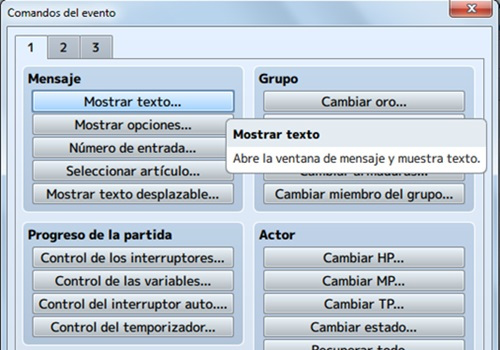
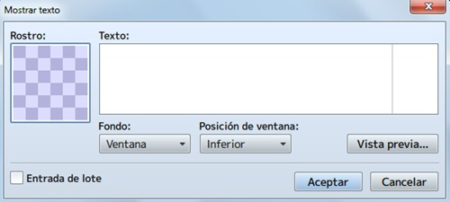
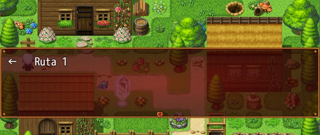
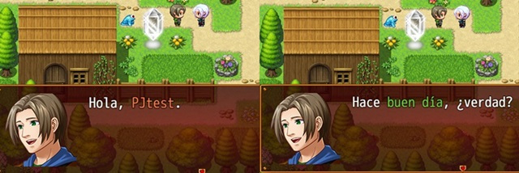

# Clase 4: Diálogos

En esta lección veremos uno de los pilares fundamentales de cualquier videojuego, los **diálogos**, veremos la importancia de los diálogos de los personajes como medio para transmitir parte de la historia y de como esta se va desarrollando mediante la información que podemos hacer que los NPCs (Non-Player Character) cuenten al jugador.

Ademas veremos como crearlos utilizando el asistente de diálogos de RPG Maker, los diferentes tipos, como diálogos encadenados, elecciones, dar énfasis a texto mediante colores, etc y cómo implementarlos mediante un evento en el juego.

## Objetivos del día

- Conocer la importancia de los diálogos en los videojuegos.
- Aprender a crear un dialogo simple con RPG Maker.
- Aprender a crear un dialogo encadenado.
- Aprender a crear un dialogo de decisión.
- Aprender a crear un dialogo desencadenante de evento.
- Aprender a colorear un texto.
- Implementar todo lo aprendido a nuestro proyecto principal.

## Teoría
---
### Cómo crear un diálogo

Se trata de crear un evento (persona, ente invisible, narrador, monstruo, enemigo, cosa que habla, etc.), dándole un aspecto gráfico en ciertos casos. 
La mecánica será igual para todos los casos. Lo único que va a diferir es la complejidad y el tamaño del diálogo o conversación. Lo primero será crear el evento, crear un nuevo comando de evento (doble click o click derecho > nuevo…) y seleccionar Mostrar texto (pestaña 1, en el cuadro Mensaje).

De este modo, aparecerá la ventana de Mostrar texto, donde escribirás la parrafada que se te ocurra. Tiene varias opciones que explico a continuación:

**Rostro:** haciendo doble click, aparecerá una ventana donde podrás elegir la face que quieras (incluso la del PJ, si estás escribiendo un texto pronunciado por el susodicho).

**Texto:** aquí introducirás las palabras y códigos para crear el mensaje. Si dejas el puntero del ratón sobre el cuadro unos segundos, aparecerá un tag con los códigos (carácter de control) que puedes usar. Por ejemplo: si escribes “\$” (sin comillas), se abrirá la ventana del dinero/oro al ejecutar el evento en la partida.
Si te fijas, en la parte derecha hay una raya finita: marca el límite para el texto. Si te pasas, el texto se cortará. Lo recomendable, en ese caso, es pasar a la siguiente línea (dándole a Enter).

**Fondo:** el background donde se visualizará el texto (ventana, oscurecer o transparente). Por defecto, ventana.
Posición de ventana: dónde aparecerá el texto en el juego (superior, centro o inferior). Por defecto, inferior.
Vista previa: muestra cómo quedaría el texto en el juego, incluyendo algunos códigos (como, por ejemplo, colores).

**Entrada de lote:** activar esta opción te permite crear mensajes con más de cuatro líneas. Es otro límite, ya que a partir de la quinta línea (inclusive), se cortará el mensaje.

Explicado esto, pasaré a definir casos específicos: un texto simple (informativo), un texto variable y un texto con opciones.

#### Cómo crear un texto simple o informativo

Interacciones fáciles como: un cartel indicador, un gato que maúlla, un perro que ladra, un PNJ que siempre dice lo mismo, etc. ¿Qué hay que hacer? Tan fácil como escribir el mensaje, poner una face (si es necesario) y configurar el resto de opciones al gusto.

El resultado en el juego:

#### Cómo crear un texto variable

Interacciones que cambian según unas condiciones como, por ejemplo, una variable que almacene los días de la semana; de esta forma, el PNJ dirá algo diferente el lunes, el martes, etc. también, utilizando un interruptor para que, una vez hecha la primera acción con un evento, salte a una segunda pestaña con otro texto.

**¿Qué hay que hacer?** 

Tomando el segundo ejemplo, se escribirá el primer mensaje en la página 1, se activará el interruptor automático A y se creará una nueva página del evento. Y, en esta segunda página, se aplicará la condición de tener el interruptor automático A activo y se escribirá otro texto. De esta forma, el PNJ creado dirá el texto de la página 1 en la primera interacción; luego, repetirá el texto de la segunda página.

El resultado en el juego:

#### Cómo crear un texto con opciones

Interacciones que dan la posibilidad de elegir, provocando un resultado en cada caso. En algunas ocasiones, se podrá volver a elegir cada opción (como en un libro dividido en varios temas); en otras, habrá que elegir una vez, descartando las demás opciones (una toma de decisión frente a un PNJ para abrir un cofre de tres posibles, por ejemplo). Otra posibilidad es que un evento haga una pregunta y aparezcan dos o más opciones para responderla (una tendera, por ejemplo).

¿Qué hay que hacer? Tomando el tercer ejemplo, se escribiría el texto con la correspondiente pregunta, se seleccionaría Mostrar opciones (en la pestaña 1 de comandos, debajo de Mostrar texto), especificando el texto de cada opción (y su configuración). Tras esto, de vuelta en el código, se escribiría el texto dentro de cada opción.

El resultado en el juego:

#### Código para darle color al texto

Para darle color a una palabra, a varias o a todo un texto, se utiliza el código `\c[n]` (sin las comillas), donde n es un número entre 0 y 31. Así está programado en el RMMV. ¿Y cómo saber qué color es cada número? Yendo a la carpeta del juego, dentro de img/system está el archivo Window. En la parte inferior-derecha podrás ver los colores; se cuentan de izquierda a derecha y de arriba abajo, empezando por el 0 (blanco, el color por defecto).

**Por ejemplo, en el siguiente texto:**

Hola, \c[3]mundo\c[0]. \c[19]Amanece otro día\c[0] esplendoroso.
La palabra “mundo” se verá en verde, la frase “Amanece otro día” en azul oscuro y el resto en color blanco. 

Es importante no olvidarse de poner \c[0], porque si no todo el texto aparecerá del último color utilizado (que no sea el propio blanco).