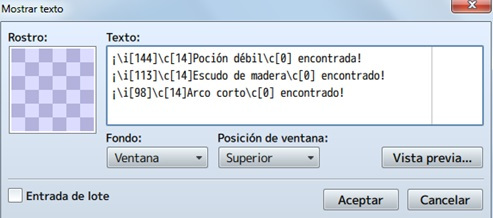

# Clase 5: Cofres

Los ítems en los videojuegos son también una parte fundamental de los mismos, normalmente podemos conseguirlos al derrotar enemigos pero también pueden ser encontrados en alijos o cofres. 

En esta clase aprenderemos a crear cofres con contenido variado, desde espadas rotas y sin valor hasta armaduras legendarias pasando incluso por incluso cofres trampa, el limite es nuestra imaginación!. Aprenderemos a integrarlos en el juego como un evento.

## Objetivos del día 

- Conocer la importancia de la obtención de ítems en el juego y los ítems clave como llaves, objetos de misión, etc.
- Aprender a relacionar la probabilidad de aparición de un objeto del juego.
- Aprender a balancear el juego mediante ítems
- Aprender a crear eventos de cofre y modificar su contenido.
- Aprender a crear cofres trampa.
- Aprender a crear cofres desencadenantes de eventos.
- Implementar todo lo aprendido a nuestro proyecto principal.

## Teoría
---
#### Cómo crear cofres extendidos

La idea básica es crear tesoros (con la forma gráfica de un cofre, tronco de árbol, bolsa, barril, etc.) que den más de un objeto como premio. ¿Y eso cómo se hace? Vamos a ello.

El programa trae definidos una serie de eventos por defecto (creación rápida de eventos, en el menú que se abre pinchando en cualquier tile del mapa con el botón derecho del ratón), entre los que está el de tesoro.

Será el primer paso, así que elige el lugar donde quieras poner el tesoro y crea el evento. Por defecto, la ventana que se abre dispone el sprite de un cofre y la posibilidad de elegir entre oro, un artículo, un arma o una armadura. Estos tres tipos de objeto se definen en la base de datos. En mi caso, dejé la imagen del cofre rojo y elegí un arma (arco corto, creado por mí).

Click en aceptar y, luego, doble click sobre el cofre (o botón derecho, editar). Aparecerá la ventana del evento, en la que has de tener en cuenta varias cosas:

- Darle un nombre al evento. Recomendable si va a haber más eventos en el mapa (sean del tipo que sean), para luego ubicarlos con mayor facilidad.
- En opciones, deja marcada dirección fija. Para evitar que el cofre se mueva como si fuese un PNJ vivo.
- En prioridad, deja igual que los personajes. Esto, en realidad, define el nivel al que está el objeto; en este caso, a la misma altura que el personaje.
- En disparador, deja botón de acción. De esta manera, el jugador tendrá que usar la tecla de acción.

- En prioridad, deja igual que los personajes. Esto, en realidad, define el nivel al que está el objeto; en este caso, a la misma altura que el personaje.

- En disparador, deja botón de acción. De esta manera, el jugador tendrá que usar la tecla de acción.

Si te fijas, este evento tiene dos páginas (o pestañas); en la segunda, no hay contenido y lo único que cambia es el sprite del cofre (aparece abierto), además de la condición interrup. auto. A marcada. 
Esto es, simplemente la apariencia que tendrá el evento tras ejecutarlo la primera vez. En resumen, para que el cofre (o lo que sea), no siga soltando el mismo premio indefinidamente.
Volviendo a la página (o pestaña) 1, vamos a centrarnos en el contenido de ésta. 

Por defecto, tenemos el sonido, la animación y el mensaje que se ejecutará al accionar el evento. Puedes personalizarlo como prefieras. En este caso, voy a explicar cómo añadir objetos y que, eso, se visualice en el juego.

#### Añadiendo objetos al tesoro

Click derecho sobre la línea cambiar armas (o lo que hayas elegido) y, luego, en nuevo.

Aparecerá la ventana de comandos de evento; en la primera pestaña, en la parte de grupo, están las cuatro instrucciones que se pueden usar: **cambiar oro**, **cambiar artículos**, **cambiar armas** y **cambiar armaduras**.

En cualquier de los casos, aparecerá una ventanita: 
utiliza aumentar en operación, y constante (seleccionando una cifra) en operando. En mi caso, añadiré una poción débil al cofre.

>Si quieres añadir más objetos, repite el proceso tantas veces como haga falta.

#### Añadiendo el texto correspondiente al mensaje

El siguiente paso es añadir las líneas de texto correspondientes, teniendo en cuenta los objetos (y el oro) que hayas añadido anteriormente. Para esto, click derecho sobre la línea texto y, luego, click en editar. Aparecerá la ventana de mostrar texto, en la cual se enumerarán los objetos faltantes (puedes cambiar el orden).

>**Importante:** si vas a añadir más de cuatro objetos, acuérdate de marcar la opción entrada de lote en mostrar texto.

El resultado en el juego:

