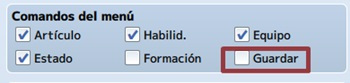
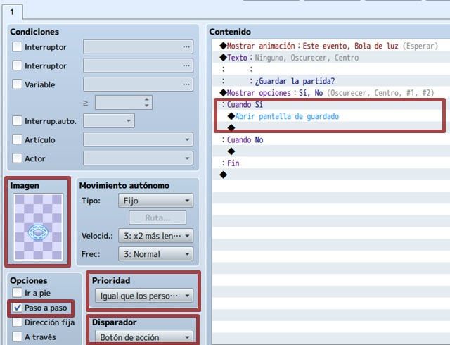
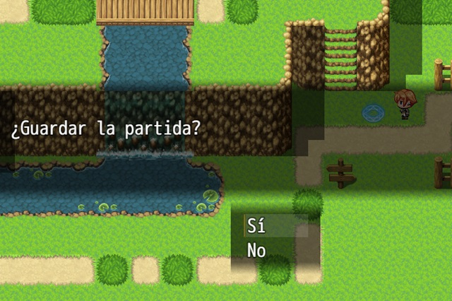

# Clase 6: Puntos de guardado

En algunos casos los jugadores no podrán continuar con su aventura por el momento, por lo que es menester darles la opción de guardar sus progresos. En esta clase aprenderemos acerca de la importancia de los puntos de guardado en los videojuegos y la lógica a seguir con respecto a la dificultad del juego aportada por esta opción, debido a que no es lo mismo tener solo una oportunidad de guardar que muchas.

Aprenderemos a crear un punto de guardado sencillo, utilizando eventos y distribuiremos los diferentes eventos de guardado por el mapa, manteniendo siempre la coherencia con nuestro juego.

## Objetivo del día

- Conocer la importancia de los puntos de guardado en los videojuegos.
- Conocer el balance de los videojuegos, mediante la mecánica de guardado.
- Aprender a crear puntos de guardado básicos.
- Aprender a distribuirlos por los mapas.
- Implementar todo lo aprendido a nuestro proyecto principal.

## Teoría
---
#### Cómo crear un punto de guardado

La idea es controlar dónde y cuándo podrá guardar la partida el jugador, provocando que la persona tras los mandos piense un poco antes de actuar.

Lo primerísimo será ir a la Base de datos > Sistema > Comandos de menú y desmarcar “Guardar”. ¿Y esto por qué? Porque, de esta manera, el comando “Guardar” no aparecerá en el menú, haciendo que la partida sea inguardable.

#### Creando un punto de guardado sencillo

Si no quieres liarte con esto, pero necesitas crear puntos de guardado en los mapas que componen tu juego, la opción más simple es utilizar el modo speed. De hecho, una vez que crees el evento, luego podrás copiarlo tantas veces como quieras. Para empezar, crea un evento donde quieras poner el punto de guardado.

Dentro de este evento, selecciona la imagen que prefieras (en mi caso, un círculo de invocación azul) y la opción “paso a paso” (permitirá que la imagen elegida se mueva, tras activar el evento). Además, prioridad en “igual que los personajes” y disparador “botón de acción”. Como la idea es que se repita indefinidamente, sólo tendremos una página en el evento.

En el contenido, puedes dar a elegir directamente o escribir un texto junto a las opciones. En cualquier caso, dentro del “sí” (o lo que hayas escrito), mete el comando de evento “abrir pantalla de guardado” (está en la pestaña 3, control de escena).

Y ya está. Por supuesto, puedes añadirle alguna animación y algún sonido (y lo que te apetezca) para que sea más cool.
