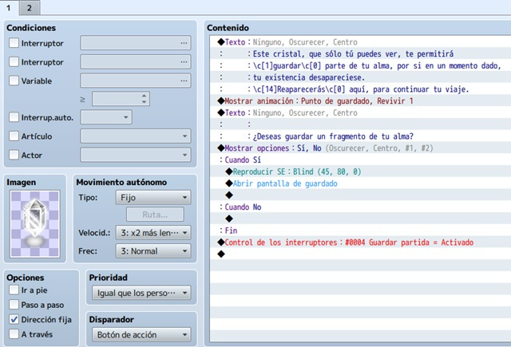
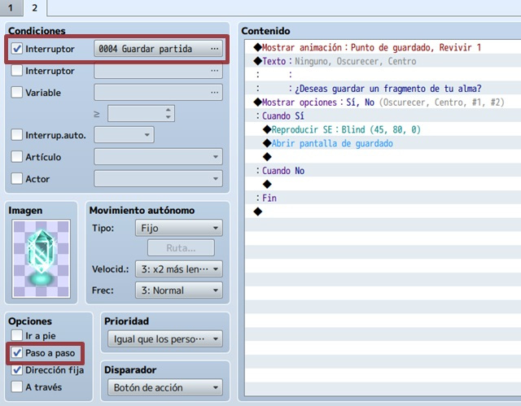
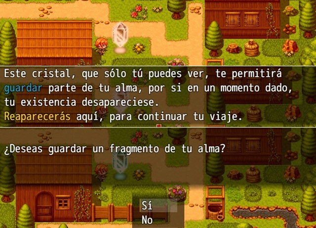

# Clase 8: Punto de guardado complejo

Ya hemos visto anteriormente cómo hacer puntos de guardado, sin embargo las mecánicas de guardado en los videojuegos van mas allá de sólo guardar el juego en un punto en concreto, en algunos casos podemos hacer que los jugadores requieran de un ítem o un evento especifico para poder guardar.

En esta clase aprenderemos a crear puntos de guardado complejos con RPG Maker, ademas también a desarrollar este concepto, haciendo arcos argumentales alrededor del requisito que solicitemos para el guardado.

## Objetivo del día

- Conocer la importancia de un punto de guardado complejo.
- Conocer los diferentes tipos de guardado complejo (con ítem, evento especial, etc).
- Aprender a crear puntos de guardado complejo en RPG Maker.
- Practicar creando una mini historia alrededor del guardado.
- Implementar todo lo aprendido a nuestro proyecto principal

## Teoría
---
#### Creando un punto de guardado complejo

Si quieres dedicarle más esfuerzo al asunto, te recomiendo esta opción: crear un punto de guardado que explique lo que es (como un minitutorial) la primera vez que se activa. A partir de ahí, funcionará igual que el sencillo. En realidad, no lleva demasiado trabajo.

En este caso, vamos a tener dos páginas en el evento. Además, hará falta crear un interruptor (en mi caso, “guardar partida”) que servirá como condición para pasar a la segunda página (y que no se repita la primera).

En la primera, elegí un cristal de color gris (simulando que el punto de guardado está inactivo). Además, con la opción “dirección fija” seleccionada (no interesa que se active su animación al iniciar el evento). 

En contenido, se presenta un texto informativo (el minitutorial) y, luego, se ofrece la posibilidad de guardar la partida (sólo pasará esta primera vez, quedando el cristal en modo inactivo. No problem). Finalmente, se activa el interruptor, pasando a la página 2.

En la segunda, hay que activar la condición (eligiendo el interruptor creado). Además, selecciona la opción “paso a paso” (ahora sí interesa que la animación del cristal se active al iniciar el evento). En contenido, es copiar lo hecho en la primera página, salvo el texto informativo y el comando activación del interruptor.

Cuando vayas a reutilizar el evento en otros mapas, si piensas que el jugador podría no guardar la partida en ese primer punto, copia y pega el evento completo en el resto de mapas (donde quieras que haya punto de guardado). Si piensas que sí guardará, puedes copiar y pegar (gracias al interruptor creado, iría directamente a la página 2) o tomar solamente lo hecho en la página 2 (quitando la condición que selecciona el interruptor, pues no es necesaria). De este modo, al activar el primer cristal, es como si el resto de cristales (repartidos a lo largo y ancho de tu juego) se hubiesen activado al mismo tiempo. Épico.

