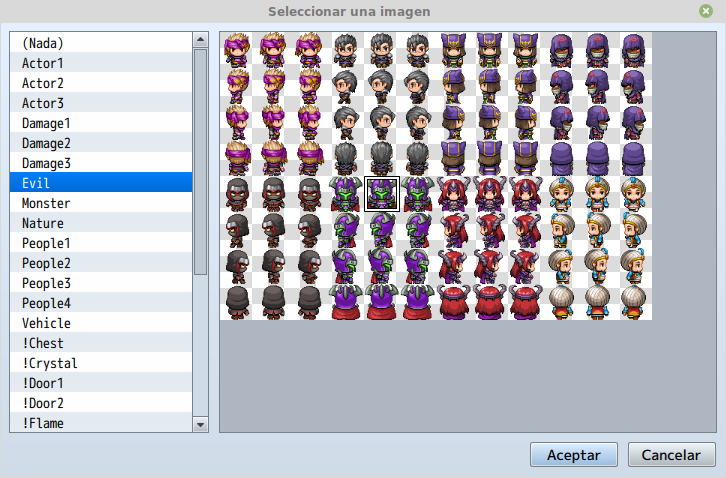
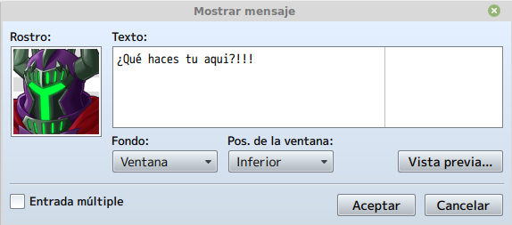
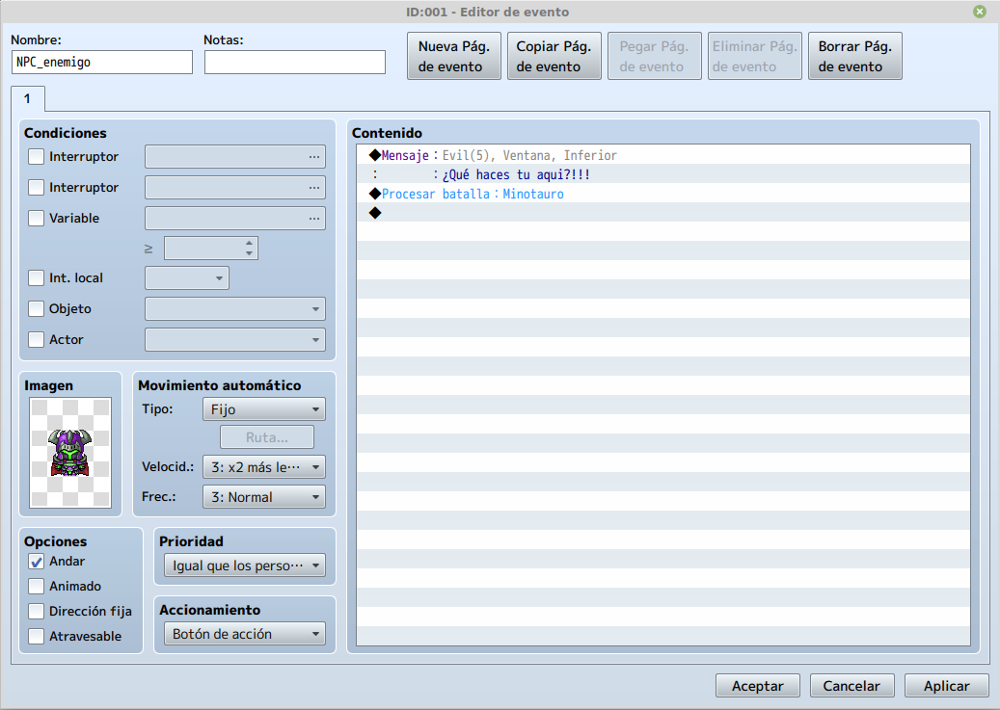
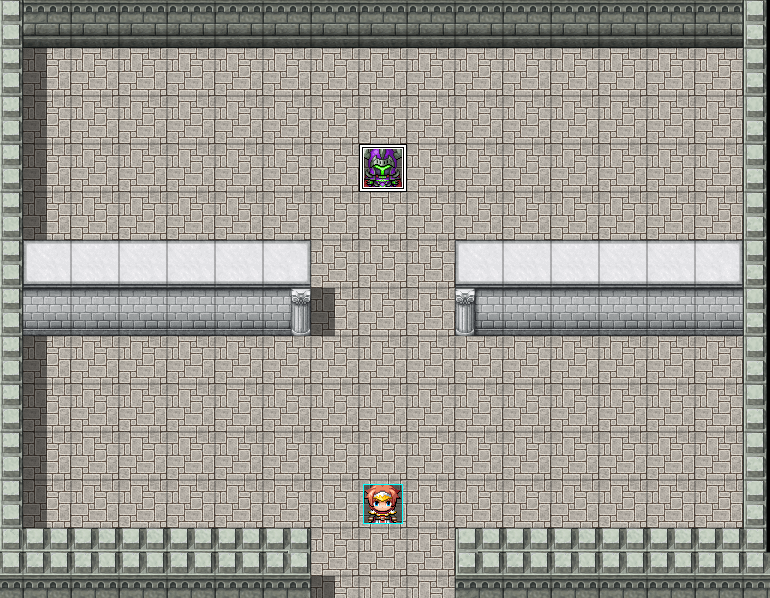
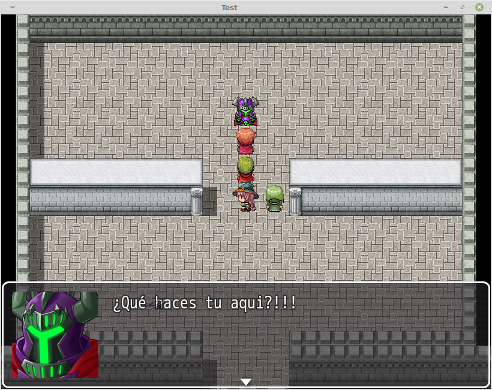

# Clase 8: Incluir enemigos

¿Qué sería de un videojuego sin sus antagonistas? ciertamente, los enemigos tienen casi la misma importancia que el personaje principal, debido a que la historia también se desarrolla en torno a ellos.

En esta clase daremos un vistazo al concepto de enemigos y su importancia en los videojuegos y su papel en el balanceo del juego, asi como también los tipos de enemigos, ya sean enemigos especiales (jefes) y enemigos de entorno (mobs).

Aprenderemos también a incluirlos con RPG Maker y a configurar sus diferentes variaciones para adaptarlos al gameplay.

## Objetivos del día

- Conocer la importancia de los enemigos en un videojuego.
- Aprender a darle un trasfondo narrativo a los enemigos especiales.
- Aprender a balancear la dificultad del juego con estos elementos.
- Aprender a agregar enemigos especiales con RPG Maker.
- Aprender a crear grupos de enemigos con RPG Maker.
- Aprender a configurar los diferentes tipos de enemigos.
- Implementar todo lo aprendido a nuestro proyecto principal.

## Teoría
---
### Enemigos en los videojuegos

A lo largo del desarrollo necesitaremos implementar NPCs enemigos con los que solo iniciaremos una batalla cuando interactuemos con ellos, ademas que, si queremos darle profundidad a nuestro juego, podemos darles un dialogo previo a la batalla y que luego, al ser derrotados, nos den mas información acerca de la historia.

### Creando NPC enemigo

Una vez tengamos diseñado el recinto, entraremos al modo evento y seleccionaremos un recuadro donde queremos que se ejecute el evento y daremos a click derecho **nuevo**. Ya en la ventana de evento, primero debemos escoger una imagen para el evento, que en este caso sera la miniatura del NPC enemigo.

Una vez seleccionada la imagen del evento, vamos a añadirle un texto que nos dirá cuando interactuemos con él, este texto podrá contener parte de la historia que queremos contar o mostrar una emoción del enemigo para dar un énfasis mayor a la batalla. Para ello añadiremos una nueva linea de evento y seleccionaremos la opción **Mostrar mensaje** en la pestaña 1.

Terminado el paso anterior, pasaremos a añadir el evento que desatará la batalla, para ellos añadiremos una nueva linea de evento y seleccionaremos la opción **Procesar batalla...** en la pestaña 3. Dentro elegiremos el enemigo y definiremos si podemos huir o no de la batalla.

Si hemos realizado todos los pasos anteriores adecuadamente, deberíamos tener algo como esto.

Como se puede ver en la imagen, el evento ya esta creado y listo para ser ejecutado.

Si probamos el mapa podemos ver que el evento se ejecuta sin problemas, cuando interactuamos con el enemigo.

