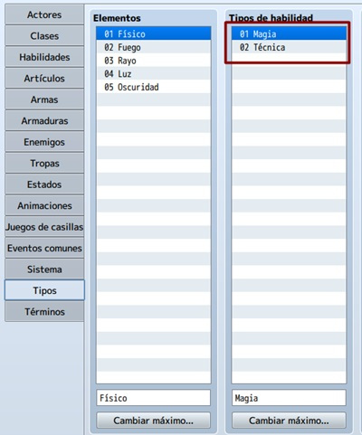
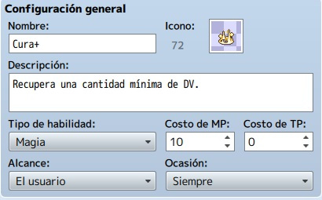
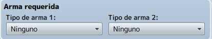

# clase 9: Crear habilidades nuevas

Como todo aventurero, nuestro personaje principal necesitara habilidades que pueda utilizar un su aventura. Dichas habilidades pueden ser propias del jugador o incluso aprendidas de alguna forma durante el juego.

En esta clase aprenderemos acerca de las diferentes clases de habilidades para los personajes y como esto afecta al balance de nuestro juego. También veremos la mecánica de turnos para las habilidades.

Además aprenderemos a crear **habilidades nuevas** con RPG Maker, asi como su configuración e implementación en nuestro proyecto.

## Objetivos del día

- Conocer la importancia de las habilidades en los juegos.
- Conocer los diferentes tipos de habilidades y sus características.
- Aprender a mantener el balance en las habilidades.
- Aprender a configurar los turnos en el juego.
- Aprender a crear y configurar habilidades nuevas.
- Implementar todo lo aprendido a nuestro proyecto principal.

## Teoría
---
#### Cómo crear una habilidad

Voy a adentrarme en la base de datos del RPG Maker MV. Concretamente, en la pestaña “Habilidades” para tratar de explicar detalladamente qué hacer ahí.

Lo primero será diferenciar los tipos de habilidad que habrá en el videojuego. Con esto me refiero a, por ejemplo, habilidades mágicas (consumen puntos de magia o maná) y habilidades especiales (consumen TP o puntos técnicos, como los denomino). Por supuesto, puedes tener más tipos de habilidad; un tercer tipo podría consumir MP y TP.
Para esto, iremos a la base de datos y a la pestaña “Tipos”.

En la columna “Tipos de habilidad” aumentaremos el máximo (si es necesario), y nombraremos las diferentes habilidades a utilizar. En mi caso, tendré Magia y Técnica.

Una vez definidos los tipos de habilidad, iremos a la pestaña “Habilidades”. Aconsejo aumentar el número máximo (en “Cambiar máximo”) según lo planeado para el videojuego. Es decir, si vas a tener hechizos del PJ, combos especiales, habilidades y hechizos de los enemigos, reserva una buena cantidad de espacios (y divide en secciones, para que sea más fácil buscar luego, por si hay que editar).

Tras esto, crearemos la habilidad convenientemente, eligiendo un lugar vacío de la lista o editando una existente.
Como puedes ver, cada habilidad tiene siete apartados a cumplimentar: configuración general, invocación, mensaje, arma requerida, daño, efectos y nota.

#### Configuración general

Lo primero es ponerle un nombre que la defina, junto con el icono y la descripción (aconsejable, para que el jugador sepa qué hace). Además, elige el tipo de habilidad (aparecen las etiquetas configuradas en la pestaña “Tipos”), el alcance (el objetivo donde se producirá el efecto de la habilidad) y la ocasión (dónde se podrá utilizar la habilidad: nunca, sólo en batalla, sólo en el menú o siempre). Si consume MP, introduce una cifra la casilla costo de MP; si consume TP, la cifra irá en costo de TP. Es posible que una habilidad gaste MP y TP (habrá que poner una cifra en cada), o nada en absoluto (ambas se quedan en 0).

#### Invocación

En este apartado se controla la velocidad (entre -2.000 y 2.000) con la que se realiza la acción: la cifra se suma a la agilidad del PJ, PNJ o enemigo y se compara con el resto de acciones de ese mismo turno. Es como la tirada de iniciativa en el rol de mesa. El éxito marca la probabilidad de que la habilidad se realice: cuanto más bajo sea el porcentaje, menos probable de que sea lleve a cabo. El repetir se refiere al número de veces que hará efecto la habilidad. 

La ganancia TP contempla la posibilidad de aumentar el número de TP con cada uso de la habilidad. El tipo de acierto se refiere a cómo se determina si la habilidad surte efecto en el objetivo: acierto certero es un uso exitoso, ataque físico compara la tasa de acierto del usuario con la tasa de evasión del objetivo, ataque mágico depende de la tasa de evasión mágica del objetivo. La animación se refiere al efecto visual que se reproduce con el uso de la habilidad.

#### Mensaje

En este caso, las dos líneas se pueden usar para escribir un texto que aparecerá en el log de batalla, cada vez que se use la habilidad. En la imagen, el %1 se refiere al nombre de la habilidad.

>**Nota:** acuérdate de dejar un espacio justo al principio, para que el nombre del PJ, PNJ o enemigo no se pegue al mensaje que escribas.

#### Arma requerida

En este apartado se puede seleccionar un arma que sea condición para usar la habilidad. Es decir, si creas una habilidad que sea propia para una espada, aquí deberás elegir (en tipo de arma 1) “espada”. También funciona como un condicional “o”, puesto que se puede elegir una segunda arma (en tipo de arma 2), para usar la habilidad. Esto es, una técnica para arco y ballesta, por ejemplo.

En caso de no elegir armas, la habilidad podrá usarse con cualquier tipo (incluyendo sin armas).

#### Configurando daño

Este apartado puede usarse o no, dependiendo de la habilidad. Básicamente, define el tipo y cuantía del daño que hará la habilidad sobre el objetivo; también se contempla un uso positivo sobre el usuario.

En tipo hay siete opciones: ninguno, daño HP o MP, regenerar HP o MP y drenar HP o MP. El elemento se refiere a la naturaleza de la habilidad; tiene efecto si defines a un enemigo débil contra el fuego, por ejemplo. Si no, es un simple apunte narrativo.

En fórmula se define el cálculo para hallar el valor del daño (o de la cura o del drenaje). Debes tener en cuenta la nomenclatura: se utiliza a para referirse al usuario, b para el objetivo y luego el punto (.) para acompañar a las etiquetas de los parámetros correspondientes (ataque, defensa, ataque mágico, defensa mágica, etc.).

La variación se refiere al porcentaje de fluctuación del resultado obtenido en la fórmula. Por ejemplo, utilizando la de la imagen: si el usuario tiene un ataque mágico (mat) de 10, el resultado sería de 25 + 10*2,5 = 50 con un 20% de variación. Esto es, el resultado final estaría entre 50 – 50*0,2 (40, mínimo) y 50 + 50*0,2 (60, máximo).

Aciertos críticos se refiere a si habrá probabilidad (definida en el ex-parámetro tasa crítica) o no de que el resultado obtenido (según la variación) se multiplique por la cifra predeterminada en el código interno del MV.

#### Configurando efectos

Hay cuatro pestañas de efectos: 

- **Recuperar** (para restaurar HP, MP y/o TP en porcentaje y/o con valor fijo).
- **Estado** (para añadir o quitar estados con una cierta probabilidad).
- **Parámetros** (añade o quita ventajas y desventajas durante un número definido de turnos).
- **Otro** (diferentes efectos añadidos, como aumentar un parámetro de forma permanente o activar un evento común).

#### Creando nota

Este cuadro de texto se usa para apuntar información o detalles sobre la habilidad, o para usar etiquetas propias de algún plugin (Action Sequence de Yanfly), por ejemplo. Lo escrito aquí no se visualiza en la partida; es código para uso interno o comentarios (estilo //texto-que-sea en JavaScript).

Nota importante: para que el PJ pueda usar los tipos de habilidad creados, recuerda añadir esos atributos en la pestaña “Actores” (si quieres que uno o varios PJs usen uno o varios tipos de habilidad) o “Clases” (si quieres definir qué clases podrán usar uno o varios tipos de habilidad.

