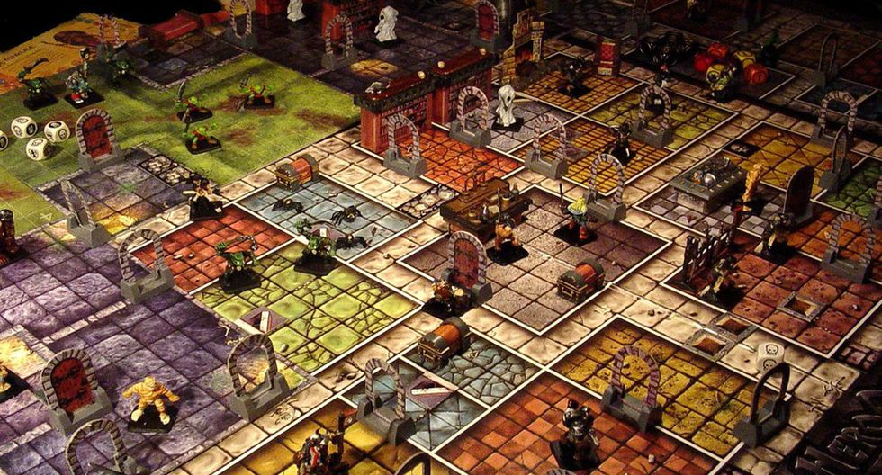
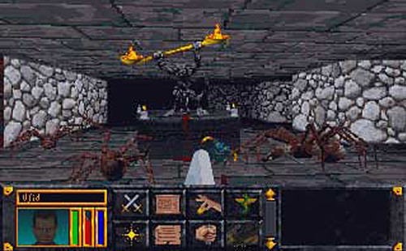
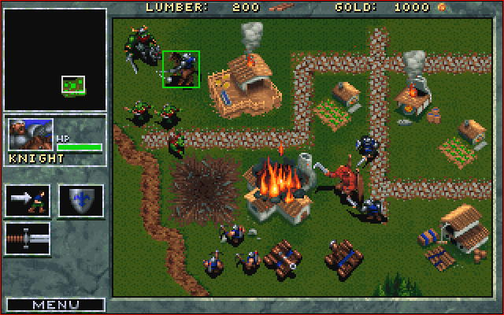
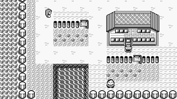
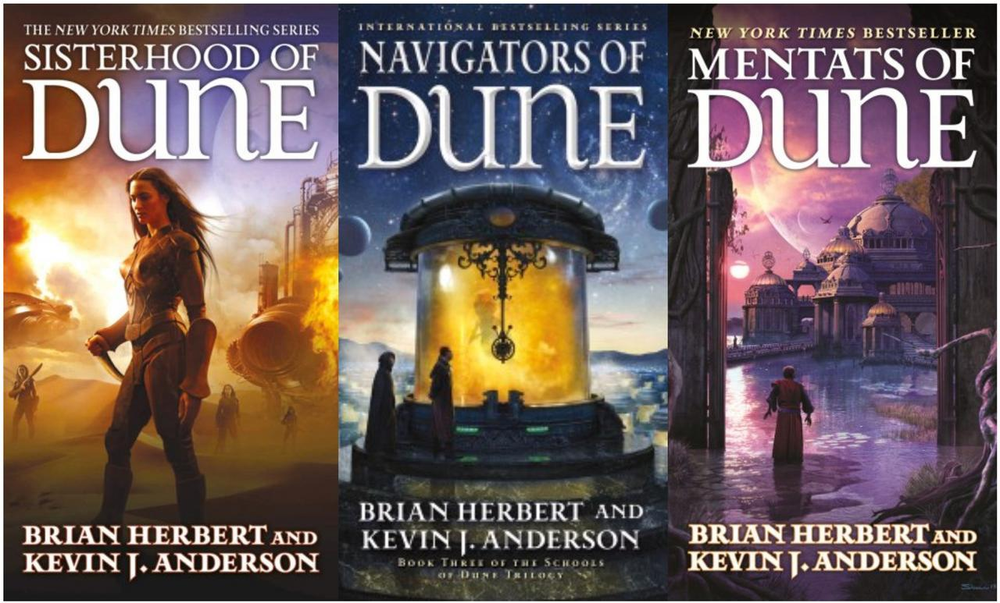
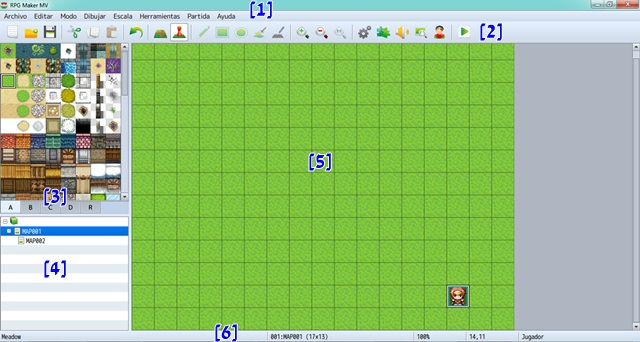
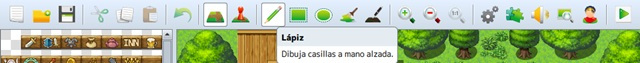
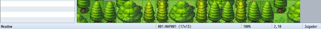
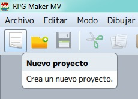
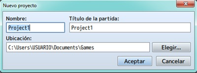

<h1 style="text-align:center;"> Introducción a RPG Maker </h1>

En esta clase daremos un breve vistazo al desarrollo de videojuegos a lo largo de la historia y en como estos han ido cambiando hasta nuestros días. Ademas veremos los conceptos básicos del desarrollo de los mismos como son una historia, el diseño de niveles, la narrativa, etc.

Tendremos también una introducción al programa RPG Maker, donde veremos los conceptos básicos, como la interfaz del programa y las diferentes herramientas que utilizaremos creando nuestro primer videojuego.

## Objetivos del día

- Conocer como ha sido el desarrollo de los videojuegos hasta nuestros tiempos.
- Aprender a desarrollar una historia para un videojuego.
- Aprender mediante otros juegos de la industria, el desarrollo de mapas (2D, 3D, FPS, etc)
- Conocer el programa RPG Maker y las diferentes herramientas con las que contaremos.
- Crear nuestro primer videojuego funcional.

## Teoría
---
### 1. Historia de los videojuegos de rol

En un principio los juegos de rol eran jugados en tableros, un clásico de este género es el famoso **Calabozos y dragones**. En este juego cada jugador tenia un personaje con el que completar la aventura, era habitual que los jugadores se inventaran una historia de fondo para sus personajes, una especie de **motivación** que los llevaba a realizar tal aventura.

Las acciones estaban divididas en turnos, donde el jugador lanzaba un dado y se desplazaba la cantidad de casilla que obtuviera.

Un juego desde luego bastante complicado, ya que se debía llevar la cuenta de cada stat del personaje ademas de calcular matemáticamente el daño realizado a un monstruo.

Más tarde con la masificación de los ordenadores personales, comenzaron a proliferar los juegos de RPG (Role Play Game) en esta plataforma, uno de los mas conocidos fue **The elder scrolls: Arena**

Este juego utiliza la perspectiva de **primera persona** por lo que podemos vivir la aventura desde los **ojos** del personaje.

Sin embargo los juegos que crearemos en este curso no son juegos en primera persona, si no mas bien, utilizaremos otra perspectiva llamada **isométrica**. En esta perspectiva podemos observar como se desarrolla el juego con una vista desde arriba.

Uno de los primeros juegos en usar esta perspectiva fue el ultra conocido Warcraft 1. Este juego, no fue un juego de rol propiamente dicho, pero estaba claramente influenciado por este género.

Mas adelante en el tiempo, una compañía llamada **Nintendo** (compañía que en algún momento de su historia fabricaba naipes) lanza un el clásico **Pokemon**, un juego de rol con una perspectiva variante de la isométrica llamada **Top-Down** la cual nos presentaba el mapa como una proyección ortogonal.

No podemos terminar este apartado sin mencionar uno de los juegos de rol mas conocidos en todo el mundo, **World of warcraft**, en este juego podemos variar este la perspectiva en primera persona y tercera persona. El juego esta ambientado en el universo del que lleva su nombre y nos permite desde configurar a nuestro personaje con diferentes clases (mago, guerrero, druida, etc) hasta escoger un sexo y una raza (humano, trol, orco, enano, etc). Siendo el juego un programa informático podemos jugarlo sin que el hecho de llevar las cuentas sea una desventaja ya que el juego se encargara de reorganizar las estadísticas con cada subida de nivel.

### 2. El guión

Ya hemos visto como ha sido a la evolución de los juegos de rol a lo largo de tiempo, y de como estos han ido cambiando de técnicas de visualización para adaptarse a las limitaciones del hardware de su época.

En este apartado veremos la parte mas importante de un juego (sobre todo de los de rol), su **historia**. La mayoría de juegos que hemos visto beben mucho de la literatura de fantástica como **El señor de los anillos**. 

> Una serie de libros que cuentan las hazañas de un grupo de héroes en su misión de destruir en anillo único en el monte del destino. 

También tenemos el conocido juego de **StarCraft** que toma muchas referencias de la saga de libros **Dune**.

> Saga de ciencia ficción que narra los conflictos políticos entre diferentes planetas.

Como podemos ver, cuanto mejor sea la historia es mas probable que mejor sea nuestro videojuego, ya que el jugador siempre se sentirá atraído por una historia mas interesante. Por lo tanto, para empezar a desarrollar nuestra historia debemos de hacernos las siguientes preguntas:

- ¿Qué motiva al personaje a realizar su aventura?
- ¿En qué época se desarrolla la historia? (pasado, presente, futuro)
- ¿Cuál es el desencadenante de la historia?
- ¿Tomaremos prestadas ideas de alguna historia conocida?
- ¿Cuáles son las motivaciones del villano?
- ¿Existe alguna relación entre el héroe y el villano?
- ¿Cómo terminará nuestra historia?
- ¿Es posible una segunda parte?

### 3. RPG Maker

RPG Maker es un software que nos permite en muchas otras cosas la planificación, implementación, testeo y producción de videojuegos. Como su nombre indica, el software se especializa en la creación de juegos tipo RPG.

En este caso, voy a centrarme en el RPG Maker MV (RMMV, para acortar), que fue liberado en 2015.
¿Por qué esta versión y no otra? Principalmente, por el conjunto de mejoras; cambios con respecto a versiones anteriores como el RPG Maker XP, RPG Maker VX o RPG Maker VX Ace. La más destacable: el tamaño de la textura (tile) aumentó de 32 x 32 píxeles a 48 x 48 px, al igual que la resolución final de 544 x 416 px a 816 x 624 px.
También, a nivel de programación, se pasó de los scripts (en Ruby personalizado, RGSS) a los plugins (en JavaScript).
¿Incidirá en el desarrollo de los juegos? Dependerá de los conocimientos de cada persona y del equipo que tenga; por lo general, diría que el JS pide más recursos que el RGSS.
Y, acerca de la distribución, con el RMMV se podrá elegir la plataforma donde jugarlo, exportándolo a Windows, Mac OS o Android/iOS. Incluso en HTML5, para jugarlo en navegador web.

  

#### ¿Dónde consigo el RPG Maker MV?

Si te entró la curiosidad y tienes dinero, puedes comprarlo en su página oficial o por Steam (facilita las actualizaciones y la gestión de DLCs). La traducción al español es demasiado literal en algunos aspectos, pero útil. Eso sí, hay elementos que se mantienen en inglés (mejor que en japonés); igual en los plugins (el código de programación).
En mi caso, utilizo la versión 1.3.4 en vez de la 1.0.1; pero el funcionamiento del programa es el mismo.

#### La ventana principal: el editor

Esta interfaz será usada para crear y editar mapas y eventos, principalmente, además de acceder a otras opciones.

#### (1) Barra de menú: 
Se desglosan todas las funciones que tiene el RMMV, pudiendo acceder a cada una desde aquí. Además, en algunas de las funciones, se muestra la tecla o combinación de teclas para acceder de forma rápida a la misma (atajo de teclado).

#### (2) Barra de herramientas:
Ofrece acceso directo a alguna de las funciones del menú. Si pasas el cursor por encima de cualquiera de los iconos (menos en algunos, por defecto), aparece información sobre la función que tiene cada uno.

#### (3) Paleta de texturas:

se muestra el tileset (conjunto de baldosas) elegido, con sus pestañas correspondientes (representan diferentes capas). Es la paleta de colores que se utilizará para pintar un mapa.
Un tile se podría definir como una baldosa, entendiendo cada mapa creado como un conjunto de baldosas (casillas) vacías. De este modo, cada casilla se rellenaría con la textura de la baldosa elegida en el tileset.

#### (4) Lista de mapas:

Se muestra la estructura listada de mapas creados en el proyecto actual.

#### (5) Vista de mapas:

Muestra el contenido del mapa seleccionado. Además, permite diseñar la apariencia y designar eventos.
 
#### (6) Barra de estado:

Muestra información sobre el mapa actual (número, nombre, tamaño y coordenadas) en los tres espacios centrales. En el de la izquierda, se mostrará información sobre la imagen donde esté posado el cursor, dentro del tileset. En el de la derecha, el nombre del evento de una casilla seleccionada en el mapa (en modo evento).

#### ¿Empezamos? El primer proyecto con RPG Maker MV

Antes que nada, asegúrate de tener espacio suficiente en el disco duro, ya que cada proyecto consumirá un buen cacho de la unidad (unos 400 MB). Tras esto, inicia el RPG Maker MV (RMMV, para acortar). Estando en la ventana principal, haz click en Archivo > Nuevo proyecto o sobre el icono de la hoja (el primero de la izquierda).

Lo siguiente será definir el nombre del proyecto y la ubicación donde se generará la estructura de carpetas y archivos necesarios. Por defecto, el proyecto se guardará dentro de la carpeta “Games”, situada en el directorio “Mis Documentos”. 

A continuación pintaremos el mapa con alguna textura e iniciaremos el juego con el botón de play para asi hacer un **test** del juego.

> De ahora en adelante tendremos un proyecto propio que iremos desarrollando a lo largo del curso.